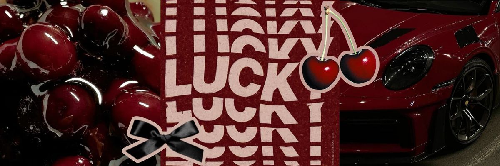
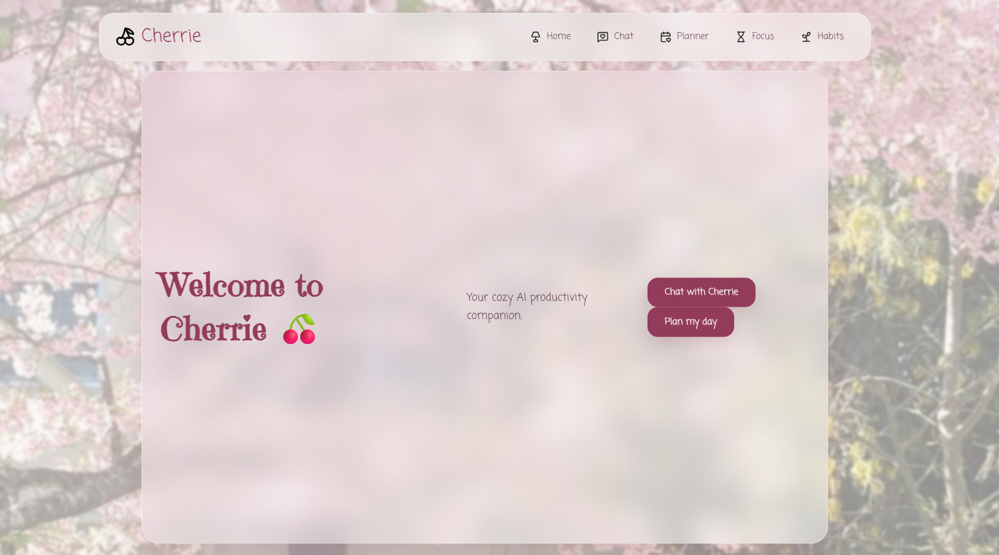
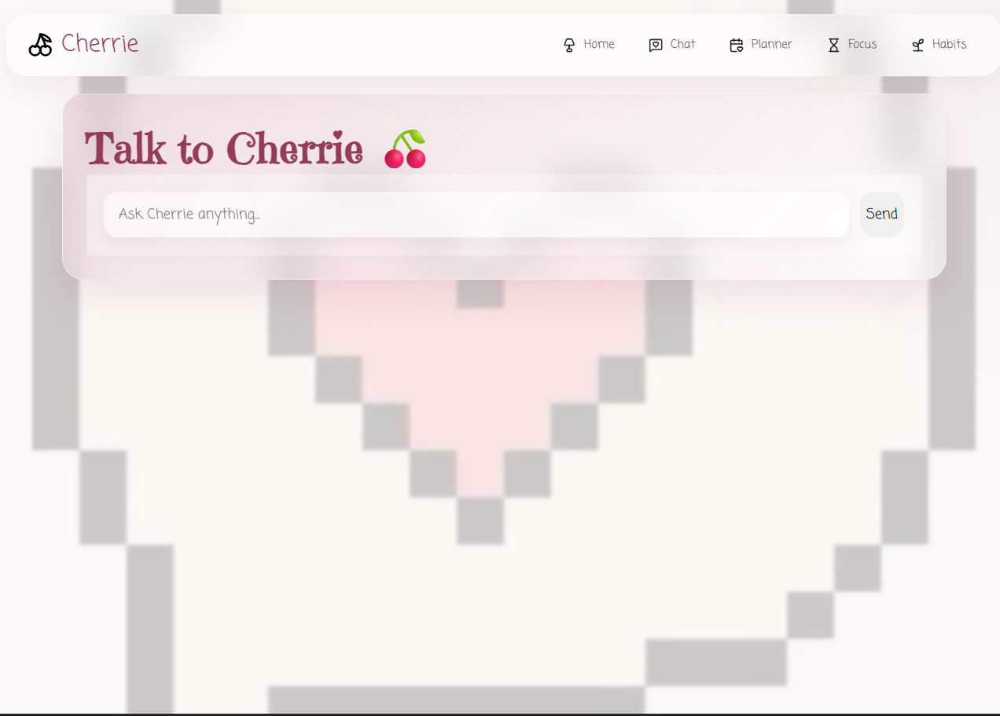
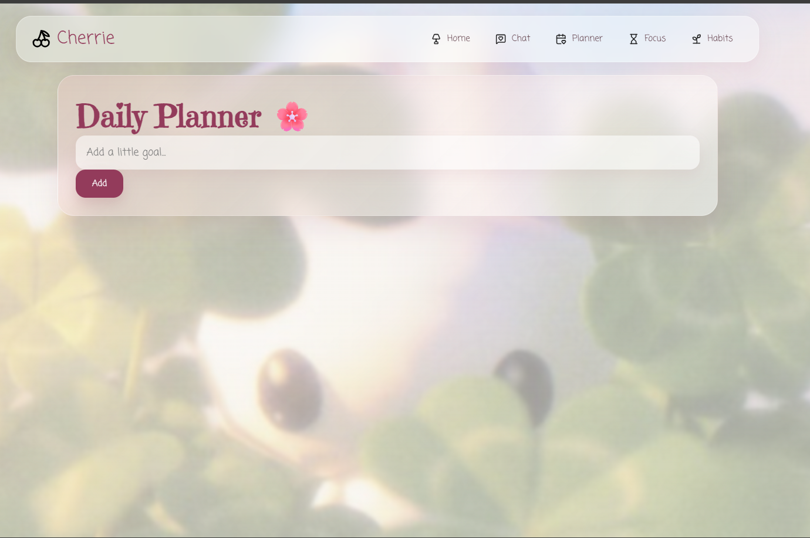
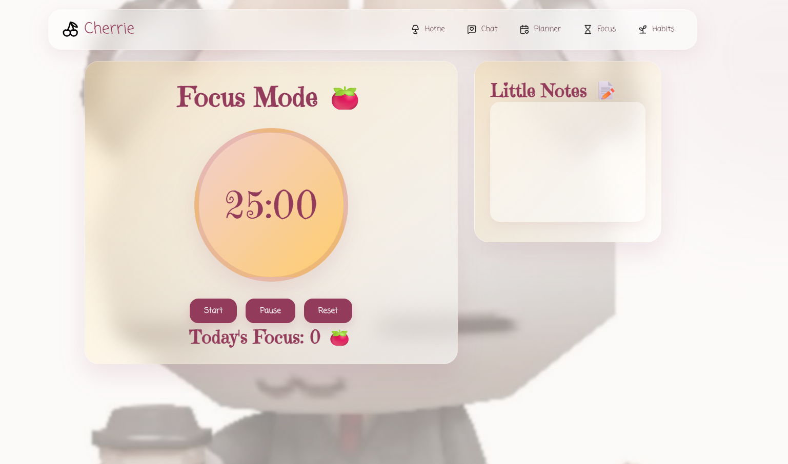
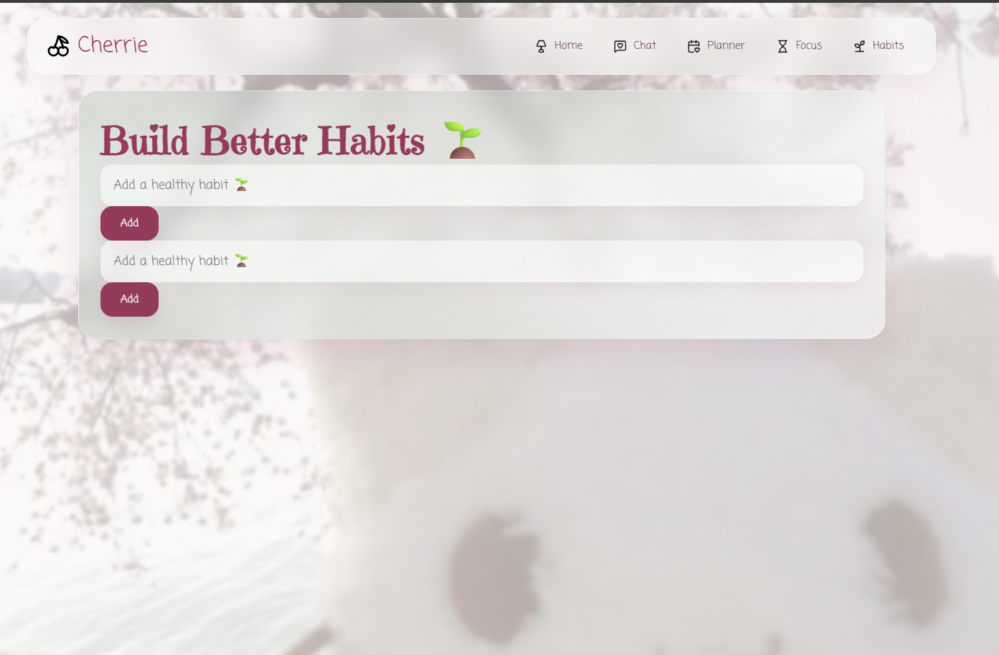

<p align="center">
  
</p>

<h1 align="center">
✦ Cherrie ♡
</h1>

<p align="center">
a little AI companion for your productive days ୨୧
</p>

# "small steps, soft routines, and a little magic in every day."

Cherrie is an AI-powered productivity companion designed to make studying, planning, and building habits feel calm, beautiful, and intentional.

Inspired by coquette aesthetics, Pinterest moodboards, and cozy digital journals — Cherrie combines productivity tools with a warm AI companion that helps you stay consistent without feeling overwhelmed.

---
<p align="center">
✦ Flask ✦ SQLite ✦ Groq AI ✦ JavaScript ✦
</p>

## ♡ Features

### ✦ AI Companion

A gentle AI assistant powered by Llama 3.3 70B that helps you:

⋆ create realistic study plans  
⋆ break overwhelming tasks into smaller steps  
⋆ organize your goals  
⋆ stay motivated and consistent  

---

### ✦ Daily Planner

Your personal little planning corner.

♡ add daily goals  
♡ mark tasks complete  
♡ remove finished tasks  
♡ keep your plans saved with SQLite  

---

### ✦ Focus Mode

A cozy Pomodoro space for deep work.

⊹ customizable focus sessions  
⊹ pause and reset timer  
⊹ track completed focus sessions  
⊹ write quick thoughts and notes while working  

---

### ✦ Habit Garden

Build tiny routines and watch them grow.

❀ add habits  
❀ check daily progress  
❀ track consistency  
❀ create a healthier workflow  

---
# ✦ Preview

<p align="center">
  
  
  <br>
  <i>home space ♡ focus corner</i>
</p>

<p align="center">
  
  
  <br>
  <i>planner ✦ habits</i>
</p>

<p align="center">
  
</p>

# ✧ Tech Stack

### Frontend

♡ HTML  
♡ CSS  
♡ JavaScript  
♡ Custom typography & animations  
♡ Glassmorphism UI  

### Backend

♡ Flask  
♡ SQLite  
♡ OpenAI SDK  
♡ Groq API (Llama 3.3 70B)

---

# ୨୧ Design Philosophy

Cherrie was designed around the idea that productivity does not have to feel cold or mechanical.

The interface combines:

✦ soft glass layers  
✦ cherry-inspired colors  
✦ dreamy typography  
✦ gentle animations  
✦ cozy productivity spaces  

A little digital room where planning feels comforting.

---

# ♡ Project Structure

```text
cherrie/
│
├── core/
│   ├── ai.py
│   └── database.py
│
├── static/
│   ├── css/
│   ├── js/
│   ├── fonts/
│   └── images/
│
├── templates/
│
├── app.py
└── requirements.txt
```


# ✦ Getting Started

Clone the repository:

```bash
git clone https://github.com/tpundir007-art/cherrie.git
```

Install dependencies:
```bash
pip install -r requirements.txt
```

Create a .env file:
```bash
GROQ_API_KEY=your_api_key
BASE_URL=https://api.groq.com/openai/v1
MODEL_NAME=llama-3.3-70b-versatile
```

Run:
```bash
python app.py
```

Open:
```bash
http://127.0.0.1:5000
```

# ♡ Future Dreams

✧ music integration
✧ personalized dashboards
✧ deeper AI memory
✧ mood-based productivity
✧ mobile experience

made with patience, tiny goals & lots of cherries ♡

— TANU <3